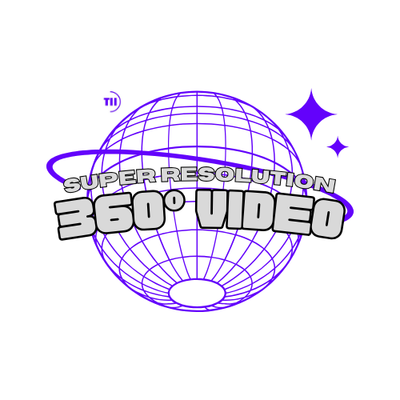

# ODVista: 360° Omnidirectional Video Streaming dataset

<!--  -->

<div align="center">
  
</div>


## ODVista description

We provide a dataset containing 200 360-degree videos, predominantly sourced from YouTube and ODV360 characterized by high quality and resolution (4K and 2K) in ERP format. All videos are licensed under Creative Commons Attribution (reuse allowed), and our dataset is exclusively designed for academic and research purposes. The video dataset encompasses various content characteristics, including outdoor and indoor scenes, as well as high motion sport contents. Each video consists of 100 frames. The dataset is partitioned into 160 videos for training, 20 for validation, and 20 for testing. Note that additional external content can be incorporated for training.

|         | Training                      | Validation               | Testing                    |
| ------- | ---------------------         | ------------------------ | -------------------------- |
| Source  | Youtube+ODV360                | Youtube+ODV360           | Youtube+ODV360             |
| Number  | 100                           | 20                       | 20                         |
| Storage | 76.7G (HR) + 103.68G (LR)     | 10.6G (HR) + 14.3G (LR)  | 11.5G (HR) + 14.7G (LR)    |


## Data access


**Downloading with AWS CLI**
The AWS Command Line Interface (CLI) offers a reliable solution for downloading the dataset. Below are the instructions and commands to synchronize the dataset from the AWS S3 bucket to your local machine. Note that these commands do not require AWS credentials, as the bucket is publicly accessible.

Install AWS CLI: If you haven't already, you will need to install the AWS CLI on your machine. You can download it from [here](https://docs.aws.amazon.com/cli/latest/userguide/getting-started-install.html).

1. Train set:
```bash 
aws s3 sync s3://odvista/train/ [Local Train Directory] --no-sign-request
```

2. Val set:
```bash 
aws s3 sync s3://odvista/val/ [Local Val Directory] --no-sign-request 
```

2. Test set:
```bash 
aws s3 sync s3://odvista/test/ [Local Test Directory] --no-sign-request 
```

If you encounter any problems or have questions regarding the data access process, please don't hesitate to reach ahmed.telili@tii.ae for assistance. 


## Baseline example results

We evaluate the super-resolved 360° videos by comparing them to the ground truth HR ERP videos. To measure the fidelity, we adopt the widely used Weighted-to-Spherically-uniform Peak Signal to Noise Ratio (WS-PSNR) as the quantitative evaluation metric. Moreover, we incorporate runtime complexity into our final scoring formula. Therefore, models that optimally balance between quality and processing efficiency are highlight more. For more details, please refer to the detailed descriptions available on the official website [here](https://www.icip24-video360sr.ae/).

| Model         | SwinIR / WS-PSNR (dB) | SwinIR / Runtime (s/2k) | SwinIR / Score | FSRCNN / WS-PSNR (dB) | FSRCNN / Runtime (s/2k) | FSRCNN / Score |
|---------------|-----------------------|-------------------------|----------------|-----------------------|-------------------------|----------------|
| Track #1 (x4) | 29.141                | 0.4458                  | 29.79          | 28.346                | 0.0013                  | 61.10          |
| Track #2 (x2) | 30.014                | 1.5232                  | 13.87          | 29.546                | 0.0041                  | 76.21          |

FSRCNN emerges as the top-performing model based on our scoring criteria. Despite SwinIR exhibiting superior quality, FSRCNN's faster run time provides it with a competitive advantage. Therefore, the optimal model is one that effectively balances quality and complexity.

**Note on computational specifications: The results presented herein were obtained using a desktop computer equipped with an Intel® Xeon 8280 CPU @ 2.70GHz × 56, 128GB RAM, and a NVIDIA RTX 6000 Ada graphics card with 48GB of VRAM.**


